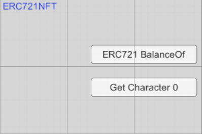
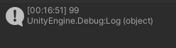

# Contract Deployed on Rinkeby
- https://rinkeby.etherscan.io/address/0x9Dcd1f7868A39A9C51545c88DAf5E7A2108F8820#code

# The Character NFT has the following stats

# UI for ERC721 NFT Interaction

 

## ERC721 Balance of button

## Get Character 0
This outputs the stat1 (here strength) of the first character that the player wallet address holds

