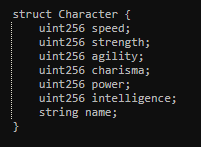
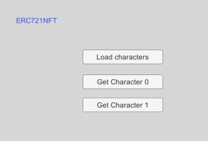
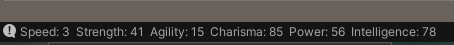
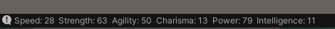

# Contract Deployed on Rinkeby
- https://rinkeby.etherscan.io/address/0x8B7995c357592Ee93FD88bA16e146E619FcCFCD0#code

# Character Stats
The Character NFT has the following stats

# UI for ERC721 NFT Interaction
This is the UI to interact with the smart contract and query data related 
to the current wallet address

 

## Load Characters
This gets the number of NFT characters owned by the player and loads 
the character stats into Unity.

## Get Character 0 
This outputs all the stats of the first character that the player wallet address holds

## Get Character 1
This outputs all the stats of the second character that the player wallet address holds

# Resources
- [Pass a bytes-32 argument in Remix](https://ethereum.stackexchange.com/questions/107812/pass-a-bytes32-as-argument-in-remix)

