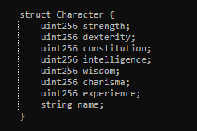

# Contract Deployed on Rinkeby
- https://rinkeby.etherscan.io/address/0x9Dcd1f7868A39A9C51545c88DAf5E7A2108F8820#code

# Character Stats
The Character NFT has the following stats

# UI for ERC721 NFT Interaction
This is the UI to interact with the smart contract and query data related 
to the current wallet address

 

## ERC721 BalanceOf
This gets the number of NFT characters owned by the player

## Get Character 0 
This outputs the stat1 (here strength) of the first character that the player wallet address holds

# Resources
- 

